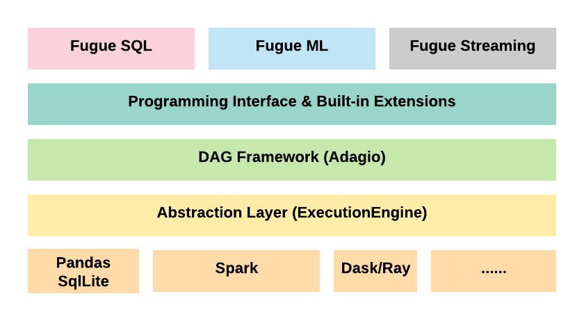

Introduction
=============

What is Fugue?
---------------

Fugue is a framework
^^^^^^^^^^^^^^^^^^^^^

It is a pure abstraction layer that adapts to different computing frameworks
such as Spark and Dask. It is to unify the core concepts of distributed computing and
to help you decouple your logic from specific computing frameworks.

Fugue is a way of thinking
^^^^^^^^^^^^^^^^^^^^^^^^^^^

It helps you rethink your problems in a platform and scale agnostic way,
it helps you separate computation and orchestration.
You will naturally write more of your logic in native python, and minimize the dependency on Fugue and
any underlying computing frameworks in your workflow. You will find your code more testable and more portable.

Why should I consider Fugue?
-----------------------------

It adapts to your code
^^^^^^^^^^^^^^^^^^^^^^^

For most cases, in order to integrate with Fugue, you only need to follow the
general `python type hints <https://docs.python.org/3/library/typing.html>`_ (which is also regarded as
good practice for writing python code), and your functions can be recognized and used by Fugue. It will
adapt to your input and output specs, you can write the logic in the most intuitive way (see
:doc:`examples <tutorial:tutorials/extensions/interfaceless>`)

It makes your logic portable
^^^^^^^^^^^^^^^^^^^^^^^^^^^^^

Fugue is an abstract computing layer, it adapts to different computing frameworks. So if you can express
your logic purely on Fugue level, it can run on all supported computing frameworks. You are also able to
prototype on local machine with small data, and then make the same workflow run on a distributed environemnt
on big data. Productionizing Fugue workflows is simple and seamless.

It improves testability
^^^^^^^^^^^^^^^^^^^^^^^^

Develop your pipelines in the Fugue way, more code especially the computation part, stays native, so
unit testing them shouldn't be challenging. For the orchestration part, since you can run with
:class:`~.fugue.execution.native_execution_engine.NativeExecutionEngine` with small mock data, they also
become more testable. `Node2Vec on Fugue <https://github.com/fugue-project/node2vec>`_ is a perfect
example to demonstrate the testability.

It's easy to onboard and offboard
^^^^^^^^^^^^^^^^^^^^^^^^^^^^^^^^^^

To onboard, most of your code will stay native and independent from Fugue. You can simly use Fugue to `glue`
your units together to be a scalable and portable workflow. On the other hand, moving away from Fugue is also
easy because there is minimal code to change. Moreover, the Fugue way of thinking will be beneficial even
when you migrate to other computing frameworks. You will get a better sense of layering your code and keeping
it less coupled with the framework.

What does Fugue NOT do?
------------------------

It does not hijack your project
^^^^^^^^^^^^^^^^^^^^^^^^^^^^^^^^

It encourages writing native python and the framework will adapt to you. So most of your logic should stay
independent. The parts related with Fugue (mostly orchestration part) should also be intuitive and readable,
it shouldn't be hard to translate to other computing frameworks.

It does not prevent you from using the underlying frameworks
^^^^^^^^^^^^^^^^^^^^^^^^^^^^^^^^^^^^^^^^^^^^^^^^^^^^^^^^^^^^^

For example, if you really need to use certain features of Spark RDD, you can create an execution engine
aware extension where you have full access to Spark Sessiuon and RDD, so you can write whatever native Spark
code that is necessary. In general, for all computing frameworks Fugue supports, you have full access to
all their features, and you can write in their native way, the only drawback is that this type of
extensions is no longer portable.

It is not for macro-level workflows
^^^^^^^^^^^^^^^^^^^^^^^^^^^^^^^^^^^^

Fugue is focusing on computataion, it's NOT another `macro-level` workflow solution such as 
`Airflow <https://airflow.apache.org/>`_, `Prefect <https://github.com/PrefectHQ/prefect>`_, 
`Dagster <https://github.com/dagster-io/dagster>`_ and `Flyte <https://github.com/lyft/flyte>`_,
instead, Fugue should be used by these solutions as tasks.
These macro level solutions focus on orchestrating your business logic, and Fugue is for computation
related logic. It's true that Fugue also uses the `DAG` concept, but it should be considered as
a `micro-level` workflow solution.

Key Features
-------------

Architecture Overview
^^^^^^^^^^^^^^^^^^^^^^

On top of different computing frameworks, :class:`~fugue.execution.execution_engine.ExecutionEngine` is
to unify the core concepts of distributed computing and adapt to different frameworks. On top of
ExecutionEngine, we use `Adagio <https://github.com/fugue-project/adagio>`_ to construct and execute
Fugue DAGs. On top of the DAG framework, we have 
:doc:`Fugue programming interface <tutorial:tutorials/advanced/dag>` with built-in extensions
such as :meth:`save <fugue.workflow.workflow.WorkflowDataFrame.save>`,
:meth:`load <fugue.workflow.workflow.FugueWorkflow.save>` and
:meth:`show <fugue.workflow.workflow.WorkflowDataFrame.show>`. On top of the programming interface,
we have :doc:`Fugue SQL <tutorial:tutorials/fugue_sql/index>` and will release Fugue ML and Fugue Streaming
later in 2020.

Extensions
^^^^^^^^^^^

Fugue extensions are the logic units you want to use Fugue to glue together. Please make sure you
understand that :doc:`it's NOT necessary to implement Fugue interfaces <tutorial:tutorials/extensions/interfaceless>`
to become Fugue extensions. For details, please read :doc:`the Extensions Tutorial <tutorial:tutorials/extensions/index>`

Programming Interface & SQL
^^^^^^^^^^^^^^^^^^^^^^^^^^^^

Users have two ways to use Fugue: :doc:`the programming interface <tutorial:tutorials/advanced/dag>`
and :doc:`the SQL interface <tutorial:tutorials/fugue_sql/index>`. The two are almost equivalent on
features, but to adapt to different users and scenarios. The programming way is great
for pythonic users and the SQL way is preferred by people who love the SQL mindset.

Fugue SQL is a SQL-like language, it's built on top of standard SQL but in the language. It's unique
because it is used to describe your end-to-end workflow, and you can easily invoke all Fugue extensions
inside the code. The syntax of the language is between standard SQL, json and python, it's fully 
compatible with standard ``SELECT`` statement syntax, meanwhile it tries to minimize the syntax overhead 
and keep the language easy to understand.

How do I get started?
----------------------

Try Before You Install!
^^^^^^^^^^^^^^^^^^^^^^^^

Before installing Fugue, you may launch a
`Fugue tutorial notebook environemnt on binder <https://mybinder.org/v2/gh/fugue-project/tutorials/master>`_

**But it runs slow on binder**, the machine on binder isn't powerful enough for
a distributed framework such as Spark. Parallel executions can become sequential, so some of the
performance comparison examples will not give you the correct numbers.

Alternatively, you should get decent performance if running its docker image on your own machine:

.. code-block:: bash

    docker run -p 8888:8888 fugueproject/tutorials:latest

Installation
^^^^^^^^^^^^^

If you only want to prototype on Fugue programming interface:

.. code-block:: bash

    pip install fugue

If you want to use Fugue SQL as well:

.. code-block:: bash

    pip install fugue[sql]

If you want to run on Spark:

.. code-block:: bash

    pip install fugue[spark]

If you want to run on Dask:

.. code-block:: bash

    pip install fugue[dask]

Many users may want to try both Spark and Fugue SQL:

.. code-block:: bash

    pip install fugue[sql,spark]

If you want to install all extras:

.. code-block:: bash

    pip install fugue[all]

What to read?
^^^^^^^^^^^^^^

Directly reading the source code or the Fugue API docs is NOT a good idea to start.
We have created tutorials for different levels of users.

:doc:`For beginners <tutorial:tutorials/beginner/index>`, you can go through the
examples without understanding everything, and you may find answers and more details
inside deep dives.

:doc:`For advanced users <tutorial:tutorials/advanced/index>`, you can go through
the examples to understand what extra value Fugue can bring to you. And if interested
you can go through the deep dives to get more insights.

git clone
^^^^^^^^^^

If you want to start from the source code:

.. code-block:: bash

    git clone https://github.com/fugue-project/fugue.git